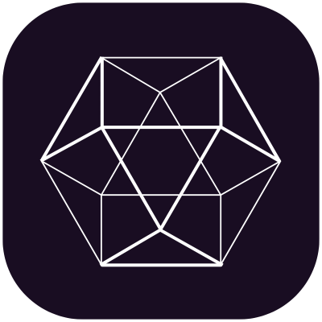

<h1>
  <div style="display: flex; flex-direction: row; vertical-align:middle; justify-content: flex-start; gap: 10px; align-content: center">gpbacay_arcane</div>
</h1>

**gpbacay_arcane** is a Python library designed for custom neuromimetic artificial neural network mechanisms, built on top of TensorFlow and Keras. It is specifically developed for the **A.R.C.A.N.E** (Augmented Reconstruction of Consciousness through Artificial Neural Evolution) project, enabling the creation of adaptive, biologically-inspired neural networks.

## Features

- **Custom Layers and Mechanisms**: Includes dynamic reservoirs, spiking neurons, Hebbian learning, self-modeling, and more.
- **Neuromimetic Capabilities**: Built for advanced spatio-temporal processing and homeostatic plasticity.
- **TensorFlow and Keras Integration**: Seamlessly integrates with TensorFlow and Keras to build sophisticated neural networks.

## Installation

To install the library, simply run:

```bash
pip install gpbacay-arcane
