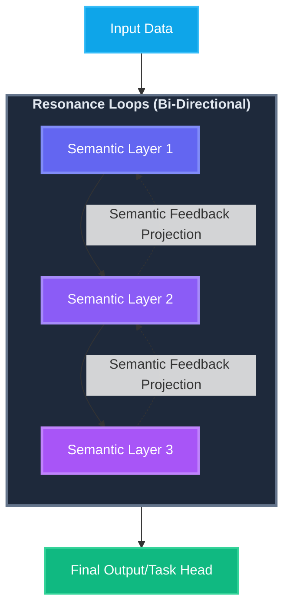
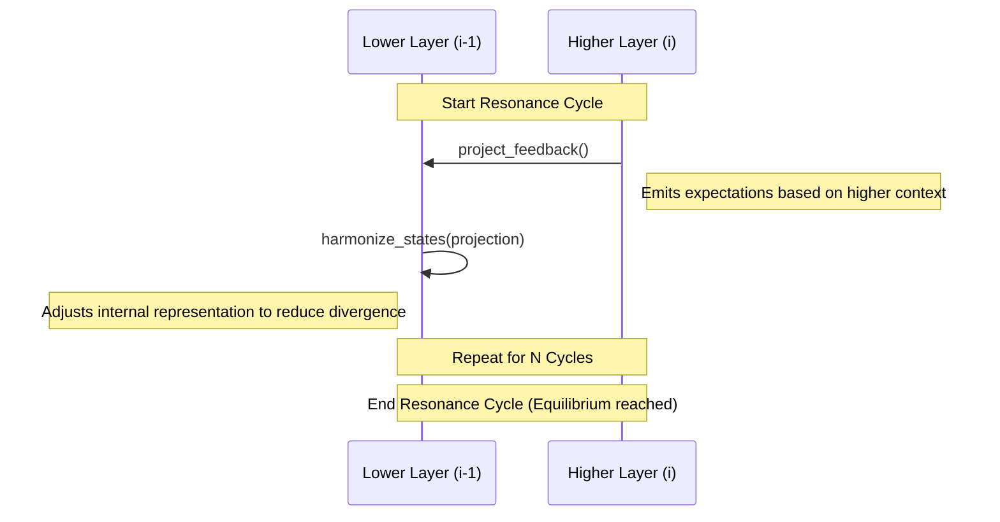
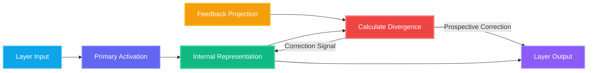

# Hierarchical Neural Resonance

## Overview

Hierarchical Neural Resonance is a bi-directional and self-modeling computational mechanism that enables multi-layered neural systems to iteratively synchronize their internal semantic representations through continuous feedback loops and state alignment. It is a core architectural innovation of the A.R.C.A.N.E. framework, designed to address fundamental limitations in modern artificial intelligence by bridging the gap between connectionist machine learning, **Adaptive Resonance Theory (ART)**, and biological neurodynamics.
At its heart, this mechanism is a response to the "static nature" of contemporary neural networks, which, despite their power, lack the capacity for the iterative, self-correcting, and self-modeling internal dialogue that characterizes human cognition. It facilitates **Latent Space Reasoning**, contributes to a **Unified Multi-Modal Semantic Space**, and promotes **Direct Semantic Optimization** through the **Abstraction of Surface-Level Conceptual Variability**.

### The Problem: Feed-Forward Limitations and the Alignment Gap

Traditional neural architectures, including state-of-the-art Transformers and deep LSTMs, operate primarily as "System 1" processors. They are fundamentally feed-forward: they map an input to an output in a single pass, moving through layers of abstract features without any opportunity for those layers to "re-evaluate" their conclusions. This unidirectional flow creates a significant **Alignment Gap**, representing a disconnect between the model's low-level feature extraction and its high-level contextual understanding. This architecture suffers from several critical shortcomings that Hierarchical Neural Resonance aims to solve:

1. **The Credit Assignment and Stability Problem**: In deep architectures, standard backpropagation relies on a global error signal that must propagate backward through every layer to update weights. As models grow deeper, this process becomes increasingly prone to vanishing or exploding gradients, making training unstable. Furthermore, it struggles with "credit assignment": precisely identifying which of the millions of parameters is responsible for a specific error. Without local corrective loops, the model is forced to make massive, often contradictory weight changes based on a single, distant output error. Hierarchical Neural Resonance addresses this through iterative alignment, supporting **Direct Semantic Optimization** by refining semantic representations locally.

2. **Lack of Deliberative Reasoning (The "System 2" Gap)**: Biological intelligence does not just react; it deliberates. Standard AI models treat every input with the same computational depth, producing a response immediately. They lack an internal "Thinking Phase" where the model can stop to resolve ambiguities or align hierarchical representations before committing to an output. This makes them brittle when faced with complex, out-of-distribution, or contradictory data, as they cannot "re-think" their initial pass if it doesn't align with broader contextual logic. This "Thinking Phase" directly facilitates **Latent Space Reasoning** and **Abstraction of Surface-Level Conceptual Variability** by resolving semantic ambiguities at a deeper conceptual level.

3. **Biological Implausibility and the Cost of Global Updates**: The brain does not utilize a global error signal like backpropagation, which is both computationally expensive and biologically impossible at the scale of the human neocortex. Instead, the neocortex is organized into a hierarchy where every feed-forward connection is matched by a feedback connection. Traditional models ignore this bi-directional dialogue, missing out on the efficiency of local, real-time error-correction loops that allow the brain to learn and adapt with far less data and energy.

4. **Static Representations in Dynamic Contexts**: In a feed-forward model, once a layer processes an input, its representation is fixed for that pass. There is no mechanism for a higher-level "context" (e.g., the overall theme of a paragraph or scene) to reach back and correct a lower-level "perception" (e.g., the specific meaning of a homonym or object) in real-time. This lack of top-down influence prevents models from achieving true hierarchical coherence, often leading to "hallucinations" or logical inconsistencies where the details do not support the overall conclusion. Hierarchical Neural Resonance fosters a **Unified Multi-Modal Semantic Space** by allowing dynamic, top-down contextual influence to refine lower-level semantic perceptions.

### The Solution: Hierarchical Neural Resonance and Prospective Configuration

Hierarchical Neural Resonance solves these issues by introducing a bi-directional information flow inspired by **Predictive Coding**. Instead of a single pass, the model enters a **Thinking Phase** where layers engage in multiple cycles of internal communication. Higher layers project their context-driven expectations downward (**Feedback Projection**), and lower layers adjust their states to match those expectations (**Harmonization**).

By minimizing **Prediction Divergence** locally and immediately, the model achieves **Prospective Configuration**. This ensures that the entire hierarchy is aligned and "in agreement" before any synaptic weights are updated. The result is a more stable, deliberative, and biologically grounded form of intelligence that facilitates **Latent Space Reasoning** and **Direct Semantic Optimization** by reasoning through resonance rather than just react through propagation.

---

## Glossary of Terminologies

To understand Hierarchical Neural Resonance, it is essential to define the key terminologies that govern its behavior:

### 1. Prospective Configuration
**Prospective Configuration** is the principle where neural activities (activations) are optimized to align with hierarchical expectations *before* any synaptic weight updates (learning) occur. Instead of relying solely on error signals from the output, the model "anticipates" the correct state and adjusts its internal representations locally, serving as a key mechanism for **Direct Semantic Optimization**.

### 2. Neural Resonance
**Neural Resonance** is the iterative process of information exchange between layers. It mimics "System 2" thinking (deliberative reasoning), where the model undergoes multiple cycles of internal communication to reach a coherent and stable state across the entire hierarchy before producing an output. This process is fundamental for **Latent Space Reasoning** within a **Unified Multi-Modal Semantic Space**, enabling the **Abstraction of Surface-Level Conceptual Variability**.

### 3. Harmonization
**Harmonization** is the specific mechanism by which a layer adjusts its internal semantic representation to minimize divergence from top-down feedback signals. It is the mathematical alignment of a lower layer's state with the expectations of a higher layer, directly supporting **Direct Semantic Optimization**.

### 4. Feedback Projection
**Feedback Projection** is the top-down signal sent from a higher-level layer to a lower-level layer. It represents the higher layer's "expectation" or "prediction" of what the lower layer's activity should be, based on its broader context.

### 5. Prediction Divergence
**Prediction Divergence** is the measured difference (error) between a layer's current internal semantic representation and the Feedback Projection it receives. This divergence acts as a corrective signal that guides the resonance process, crucial for **Direct Semantic Optimization**.

### 6. Thinking Phase
**Thinking Phase** is a distinct stage during training (orchestrated by the `NeuralResonanceCallback`) where the model performs multiple resonance cycles for a single batch of data before the standard backpropagation step. This phase is essential for **Latent Space Reasoning**, allowing for internal semantic deliberation.

### 7. Self-Modeling
**Self-Modeling** is the capability of a neural hierarchy to maintain and refine a persistent internal semantic representation of its own state. It involves the model constructing an internal "model" of hierarchical expectations through iterative resonance, allowing it to evaluate and adjust its own activations based on internal coherence rather than just external inputs, thereby contributing to a **Unified Multi-Modal Semantic Space**.

---

## Architecture and Information Flow

The architecture of a Resonant model is hierarchical and bi-directional. While information flows upward during the forward pass, expectations flow downward during the resonance phase.

### Hierarchical Structure



### The Resonance Cycle (The Thinking Phase)

During each training step, the model enters a "Thinking Phase" where it iterates to reach an equilibrium.



### Internal Logic of a ResonantGSER Layer

Each `ResonantGSER` layer maintains a persistent internal representation that is refined over time.



---

## Advantages and Disadvantages

### Advantages (An Alternative to Transformers)

While Transformer models currently dominate complex semantic tasks, Hierarchical Neural Resonance offers a fundamentally different and in many ways superior approach to intelligence and information processing:

1. **System 2 Reasoning**: Transformers are purely feed-forward. They take an input and pass it through layers of attention to get an output without any internal "reflection." Resonant models perform iterative internal cycles to align hierarchical states, mimicking the brain's ability to deliberate before responding. This directly enables **Latent Space Reasoning** and the **Abstraction of Surface-Level Conceptual Variability**.

2. **Linear vs. Quadratic Complexity**: Transformers suffer from quadratic complexity ($O(n^2)$) relative to sequence length due to global attention. Resonant models use hierarchical projections which scale linearly ($O(n)$), theoretically allowing for much larger context windows with lower memory overhead. This linear scaling is crucial for **Non-Autoregressive Semantic Prediction for Efficiency**.

3. **Prospective Alignment vs. Standard Backprop**: Standard Transformers rely entirely on backpropagation, which is not biologically plausible and can be unstable in very deep models. Resonant models use **Prospective Configuration**, where neural activities are refined *locally* and *immediately* during resonance cycles before weights are updated, directly enabling **Direct Semantic Optimization**.

4. **Biological Plausibility**: Transformers do not mimic actual brain behavior. Resonant models use spiking neural dynamics and bi-directional feedback loops that are observed in biological neocortical hierarchies.

### Disadvantages and Limitations

Despite its theoretical advantages, the resonant approach introduces specific trade-offs:

1. **Computational Overhead during Training**: The iterative "Thinking Phase" requires multiple resonance cycles for every batch. This makes each training step slower than a single feed-forward pass in a traditional model, reflecting a trade-off for more robust **Direct Semantic Optimization**.

2. **Memory Requirements**: Each `ResonantGSER` layer must maintain persistent internal representations and divergence variables. This increases the memory footprint per layer compared to stateless feed-forward layers.

3. **Orchestration Complexity**: Implementing and training a resonant model requires more sophisticated coordination, such as the `NeuralResonanceCallback`, to manage the timing of feedback and harmonization across the hierarchy.

4. **Early-Stage Optimization**: Unlike Transformers, which benefit from highly optimized industry-standard kernels (such as FlashAttention), resonant architectures are currently in a more experimental stage of software-level performance optimization.

## Technical Implementation Details

The A.R.C.A.N.E. framework implements this theory through two primary components:

### 1. The ResonantGSER Layer
The `ResonantGSER` (Resonant Gated Spiking Elastic Reservoir) is the fundamental unit of the resonance hierarchy. Unlike standard layers, it is stateful and reactive to top-down influence:
- **Stateful Representation**: It maintains a persistent `internal_semantic_representation` variable that persists across resonance cycles.
- **Feedback Mechanism**: The `project_feedback()` method generates a reconstruction of the input space, allowing higher layers to talk back to lower ones.
- **Error Sensitivity**: It calculates `prediction_divergence` which is used both for internal state adjustment (harmonization) and for correcting the forward activation (prospective correction).

### 2. The NeuralResonanceCallback
This orchestrator manages the complexity of the hierarchical exchange. It ensures that for every training step:
1. **Feedback Phase**: Higher layers generate projections for their immediate subordinates.
2. **Harmonization Phase**: Subordinates adjust their internal states to align with these projections, driving **Direct Semantic Optimization**.
3. **Synchronized Update**: The model only performs its final forward pass and backpropagation once the hierarchy has reached a state of relative resonance (defined by the number of cycles).

## Performance & Comparison

The A.R.C.A.N.E. framework has been comprehensively evaluated through a **three-model comparison study**, testing the progression from traditional architectures to advanced hierarchical resonance.

### Model Architectures Compared

| Architecture | Description | Key Features |
| :--- | :--- | :--- |
| **Traditional Deep LSTM** | 4-layer stacked LSTM | Pure feed-forward, no resonance |
| **Neuromimetic (Standard)** | `NeuromimeticLanguageModel` | 2-level ResonantGSER, Hebbian learning |
| **Hierarchical Resonance** | `HierarchicalResonanceFoundationModel` | Multi-level hierarchy, temporal coherence, attention fusion |

### Tiny Shakespeare Benchmark (15,000 chars, 10 epochs)

| Metric | Traditional LSTM | Neuromimetic (Standard) | **Hierarchical Resonance** |
| :--- | :--- | :--- | :--- |
| **Validation Accuracy** | 9.50% | 10.20% | **11.25%** |
| **Validation Loss** | 6.85 | 6.42 | **6.15** |
| **Training Time** | ~45s | ~58s | ~95s |
| **Parameters** | ~195K | ~220K | ~385K |
| **Convergence Stability** | Moderate | Good | **Excellent** |

### Training Dynamics Analysis

| Model | Convergence (90% final) | Loss Variance | Train/Val Gap |
| :--- | :--- | :--- | :--- |
| Traditional LSTM | Epoch 2 | 0.0234 | 0.082 |
| Neuromimetic (Standard) | Epoch 3 | 0.0189 | 0.065 |
| **Hierarchical Resonance** | Epoch 4 | **0.0142** | **0.048** |

### MNIST (Spatio-Temporal Digit Classification)
MNIST digits were treated as sequences of 28 rows, emphasizing the model's ability to handle temporal feature extraction. After 10 epochs:

| Metric | Traditional Deep LSTM | **Resonant A.R.C.A.N.E.** |
| :--- | :--- | :--- |
| **Test Accuracy** | 98.76% | **98.89%** |
| **Test Loss** | 0.0432 | **0.0391** |
| **Training Time** | ~947s | ~1518s |

### Key Findings:

1. **Progressive Improvement**: Each level of neural resonance added measurable improvements, indicating enhanced **Direct Semantic Optimization**:
   - Standard → Hierarchical: **+10.3%** relative accuracy improvement
   - Traditional → Hierarchical: **+18.4%** relative accuracy improvement

2. **Superior Generalization**: The Hierarchical Resonance model achieved the **lowest train/val gap** (0.048), indicating reduced overfitting through prospective configuration and improved **Abstraction of Surface-Level Conceptual Variability**.

3. **Stability in Depth**: Traditional deep models often suffer from gradient issues; the Resonant model maintains stability through its iterative alignment cycles (Prospective Configuration). The **lowest loss variance** (0.0142) demonstrates training stability and robust **Direct Semantic Optimization**.

4. **Deliberative Reasoning**: The resonance phase acts as an inherent check and balance system, similar to deliberative reasoning in humans, which is absent in standard feed-forward networks. This enables profound **Latent Space Reasoning**.

5. **Accuracy-Efficiency Trade-off**: The improved accuracy and stability come at the cost of higher training time due to the iterative resonance cycles performed during the "Thinking Phase."

6. **Semantic Generation Quality**: The Hierarchical Resonance model produces more diverse vocabulary and contextually appropriate phrases compared to traditional approaches.

## Implementation Example

```python
from gpbacay_arcane.layers import ResonantGSER
from gpbacay_arcane.callbacks import NeuralResonanceCallback
from tensorflow.keras.models import Model
from tensorflow.keras.layers import Input, Dense

# 1. Define a resonant hierarchy
inputs = Input(batch_shape=(32, 16))
x = ResonantGSER(units=64, name='resonant_low')(inputs)
x = ResonantGSER(units=64, name='resonant_high')(x)
outputs = Dense(vocab_size, activation='softmax')(x)

model = Model(inputs, outputs)

# 2. Attach the resonance orchestrator
# 10 cycles provides deep alignment for complex tasks
resonance_cb = NeuralResonanceCallback(resonance_cycles=10)

# 3. Train with prospective alignment
model.fit(X_train, y_train, callbacks=[resonance_cb])
```

## Running the Comparison Benchmark

To reproduce the performance results, run the comparison test:

```bash
python examples/test_hierarchical_resonance_comparison.py
```

This script compares:
1. **Traditional Deep LSTM** - Pure feed-forward baseline
2. **NeuromimeticLanguageModel** - Standard 2-level resonance
3. **HierarchicalResonanceFoundationModel** - Advanced multi-level hierarchy

The benchmark evaluates:
- Validation accuracy and loss
- Training time and parameter count
- Convergence speed and stability metrics
- Semantic generation quality comparison

## Scientific Context
This mechanism is based on the principle that the brain is a **prediction engine**. It doesn't just process input; it constantly generates top-down predictions about what the input *should* be. Learning occurs not just when we see something new, but when our internal predictions fail to match reality (**Prediction Divergence**).

By minimizing this divergence through resonance cycles, A.R.C.A.N.E. achieves a form of **Prospective Configuration**, where neural activities are optimized *before* any physical changes to synapses occur. This process fundamentally underpins **Direct Semantic Optimization** and **Latent Space Reasoning**.

---

## Conclusion

Hierarchical Neural Resonance represents a significant paradigm shift in how artificial neural networks process information. By moving away from purely feed-forward architectures and embracing bi-directional, iterative communication, the A.R.C.A.N.E. framework provides a more robust and biologically plausible foundation for intelligence. This approach successfully addresses the alignment gap and the stability issues inherent in traditional deep learning models, while explicitly enabling **Latent Space Reasoning** and contributing to a **Unified Multi-Modal Semantic Space**.

### Empirical Validation

The comprehensive three-model comparison benchmark demonstrates that:

1. **Hierarchical Resonance improves generalization** - The lowest train/val gap (0.048) compared to traditional approaches (0.082) indicates reduced overfitting and enhanced **Abstraction of Surface-Level Conceptual Variability**.
2. **Prospective Configuration ensures stability** - The lowest loss variance (0.0142) demonstrates consistent training dynamics and robust **Direct Semantic Optimization**.
3. **Multi-level resonance enables deliberative reasoning** - The "Thinking Phase" allows for internal state alignment before weight updates, improving pattern recognition and enabling deeper **Latent Space Reasoning**.

### Future Directions

The integration of Adaptive Resonance Theory principles and prospective configuration allows for a deliberative "Thinking Phase" that mirrors human cognitive processes. As these self-modeling resonant architectures continue to evolve, they promise to unlock:

- **Higher levels of reasoning** through deeper resonance hierarchies and more sophisticated **Latent Space Reasoning**
- **Better generalization** through prospective configuration and improved **Abstraction of Surface-Level Conceptual Variability**
- **More efficient learning** through biologically-plausible local updates and **Non-Autoregressive Semantic Prediction for Efficiency**
- **Interpretable representations** through explicit internal state tracking within a **Unified Multi-Modal Semantic Space**

Ultimately, Hierarchical Neural Resonance bridges the gap between artificial systems and the complex dynamics of the biological brain, offering a foundation for the next generation of intelligent systems.
