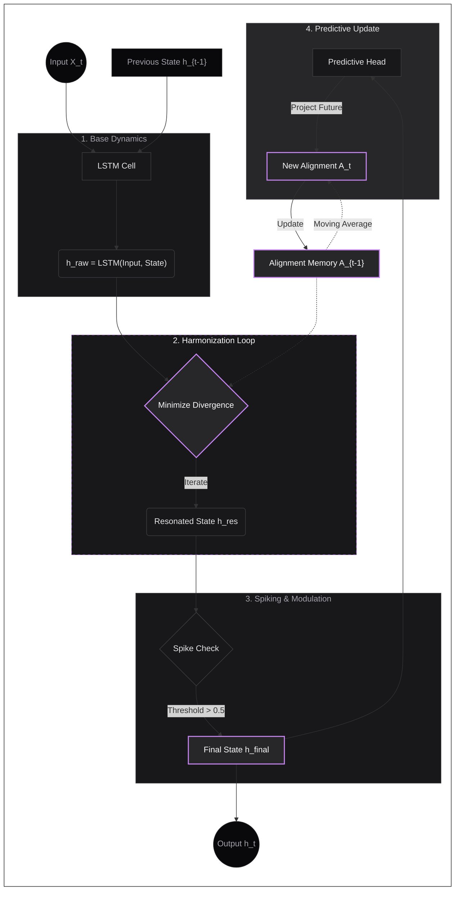

# PredictiveResonantLayer in ARCANE

## Overview

The `PredictiveResonantLayer` is a specialized RNN layer within the ARCANE framework that implements **Local Predictive Resonance**, directly inspired by **Predictive Coding theory in Neuroscience**. It mimics the brain's ability to constantly generate internal predictions about future sensory inputs and adjust its neural state to minimize "prediction error" (divergence).

Unlike the hierarchical resonance seen in `ResonantGSER`, this layer models the **local homeostatic alignment** of individual neural clusters, making it fully autonomous in maintaining its own internal world model on a per-sample basis.

## Core Philosophical Difference

| Feature | ResonantGSER | PredictiveResonantLayer |
|:--- |:--- |:--- |
| **Resonance Type** | Hierarchical (Top-Down) | Local (Self-Contained) |
| **Alignment Target** | Provided by higher layer | Generated internally |
| **State Scope** | Global/Batch-wide | Per-Example |
| **Complexity** | High (Requires connectivity) | Moderate (Drop-in replacement) |

## How It Works

The `PredictiveResonantLayer` operates through a four-stage process during each forward step:

1. Base Dynamics: A standard gated recurrent update (LSTM-based) produces a raw candidate state (analogous to **Feedforward Sensory Input**).
2. Harmonization: An iterative loop moves the candidate state toward the current "Alignment Vector" (analogous to **Top-Down Expectation Matching**).
3. Spiking & Modulation: The resonated state is modulated and passed through a biomimetic spiking mechanism (mimicking **Action Potentials**).
4. Predictive Update: A dedicated "Predictive Head" projects the final state into the future to update the Alignment Vector for the next step (mimicking **synaptic plasticity for future prediction**).

## Process Flow



### The Alignment Vector

The Alignment Vector acts as the layer's internal expectation. It is a slow-moving target that represents where the layer "believes" its latent state should be based on perceived temporal patterns.

## Implementation Details

### Configuration

```python
from gpbacay_arcane.layers import PredictiveResonantLayer

layer = PredictiveResonantLayer(
    units=128,
    resonance_cycles=3,        # Number of harmonization iterations
    resonance_step_size=0.2,   # Alpha for state adjustment
    persist_alignment=True,    # Carry alignment across sequences
    return_sequences=True
)
```

### Parameters

- `units`: Dimensionality of the latent space.
- `resonance_cycles`: How many times the state is refined toward the alignment target per step.
- `resonance_step_size`: The magnitude of adjustment in each resonance cycle.
- `persist_alignment`: If enabled, the layer stores a "global memory" of its alignment state, allowing it to maintain semantic continuity even across independent calls or batch reshuffles.

## Mathematical Mechanism

### State Harmonization
For each resonance cycle $i$:
$$h_{i+1} = h_i - \eta \cdot (h_i - A)$$
Where $h$ is the hidden state, $A$ is the alignment vector, and $\eta$ is the `resonance_step_size`.

### Predictive Update
The alignment vector $A$ is updated using an exponential moving average toward a predicted future state $P$:
$$A_{t+1} = (1 - \alpha) \cdot A_t + \alpha \cdot P(h_t)$$
Where $P$ is a learned linear transformation and $\alpha$ is a fixed slow-update rate (typically 0.1).

## Benefits

1.  **Temporal Coherence**: By harmonizing toward a moving average of its own predictions, the layer resists noise and sudden fluctuations in sequential data.
2.  **Autonomy**: It does not require complex model-wide wiring or top-down feedback loops to benefit from resonance principles.
3.  **Stateful Resonance**: With `persist_alignment`, the layer can develop a long-term "bias" or "worldview" that helps it process new information more efficiently.

## Use Cases

- **Noisy Sequence Processing**: Where temporal stability is more important than immediate reactive changes.
- **Autonomous Agents**: Where a layer needs to maintain internal consistency without external supervision.
- **Streaming Inference**: Where the model must handle continuous data streams with high temporal correlation.

---

*This documentation covers the PredictiveResonantLayer mechanism as implemented in ARCANE v3.1.0.*
